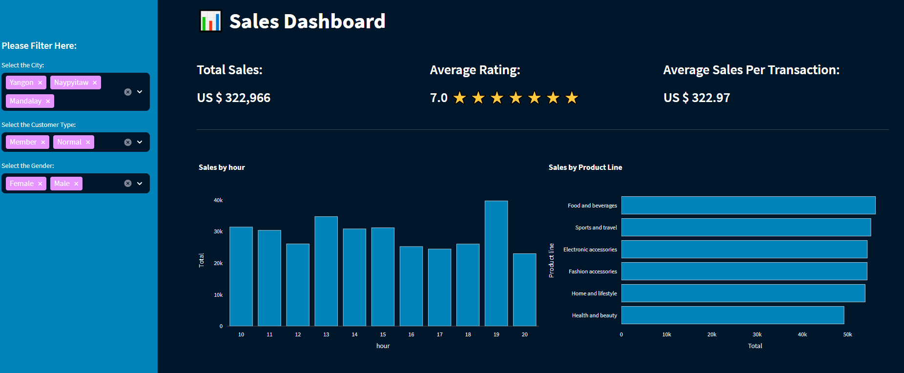

# Interactive Dashboard with Python – Streamlit

Sales Dashboard built in Python and the Streamlit library to visualize Excel data.

## Run the app
```Powershell
# vanilla terminal
streamlit run app.py

# quit
ctrl-c
```

## Demo
Sales Dashboard: https://www.salesdashboard.pythonandvba.com/

## Screenshot




## Author

- Sven from Coding Is Fun
- YouTube: https://youtube.com/c/CodingIsFun
- Website: https://pythonandvba.com


## Feedback

If you have any feedback, please reach out to me at contact@pythonandvba.com


